# Dockerizing and Deploying an Application with Kind
# Steps

## Create a docker file in your source directory
Define instructions to build your application image. This file specifies the base OS, installs dependencies, copies your code, and sets up the startup command.

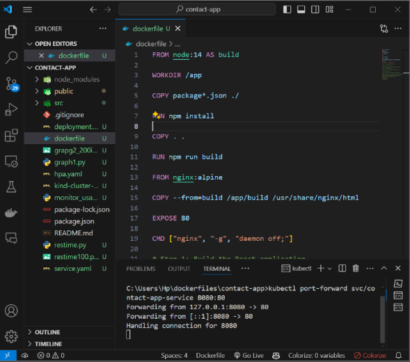

## Build the Docker Image
Use docker build with the -t flag to tag the image and a dot (.) to reference the current directory containing the Dockerfile. This creates a self-contained package of your application.

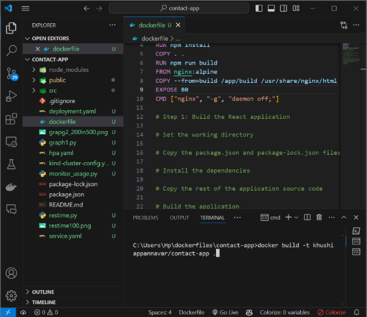

## Push the Image to Docker Hub (Optional)
If you want to share your image, log in to Docker Hub and use docker push to upload it. This makes your image accessible for deployment on other machines.

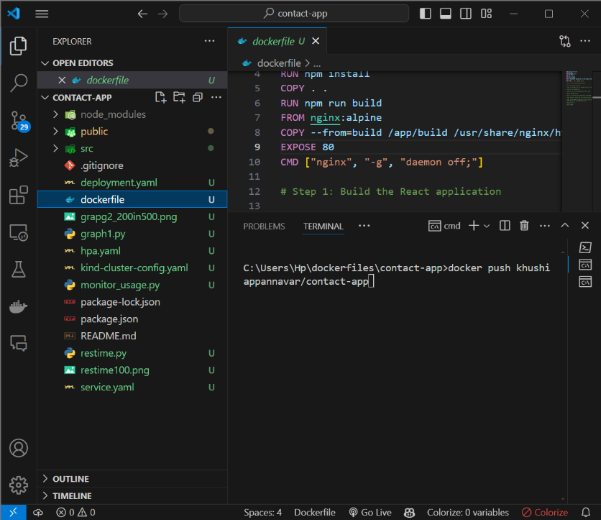

## Create a Kind Cluster (if not already created)
Kind allows you to set up a local Kubernetes cluster for testing. Run kind create cluster to create a cluster where you can deploy your containerized application.

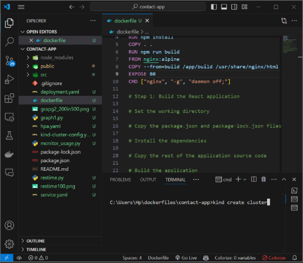

## Use the Kind Context
Switch to the Kind cluster using kubectl config use-context so Kubernetes commands interact with your local cluster. Verify the cluster information with kubectl cluster-info.

| 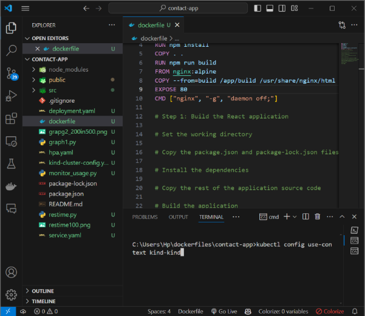 | 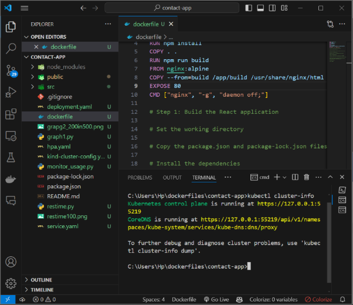 |
|--------------------------|--------------------------|

## Apply Deployment and Service YAML Files
These YAML files define how your application runs in Kubernetes. Use kubectl apply to deploy your application based on these configurations. The --validate=false flag skips initial validation for development purposes.

| 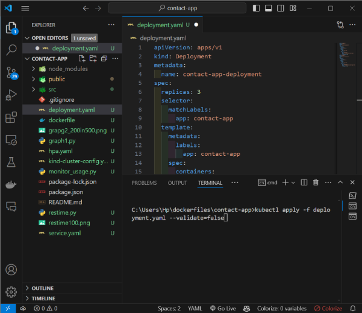 | 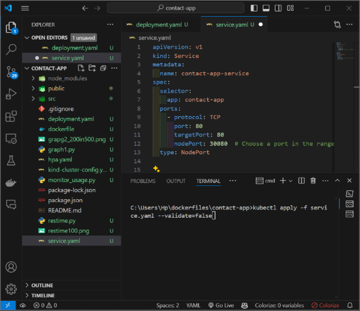 |
|--------------------------|--------------------------|

## Apply autoscalar
This YAML defines a Horizontal Pod Autoscaler (HPA) named contact-app-deployment-hpa. It automatically scales the contact-app-deployment (deployment name) between 1 and 10 pods based on CPU usage, aiming for an average CPU utilization of 50%.

## Inspecting Resources:

`kubectl get pods` and `kubectl get services` are used to verify Pods and Services and Nodes, to check if your application pods are running and services are accessible within the cluster.

`kubectl describe pod contact-app-deployment-6c7c98b5c4-dlfp8` retrieves detailed information about a specific pod named **contact-app-deployment-6c7c98b5c4-dlfp8**. It displays details like container status, pod IP address, events, and resource requests/limits

`Kubectl get nodes` lists all Kubernetes nodes (worker machines) in your cluster, displaying information like their names, operating system, status (Ready, NotReady, etc.), and role (master or worker).

`kubectl get pods -n kube-system` is used for viewing Pods in kube-system Namespace. It lists all pods running in the kube-system namespace. The kube-system namespace is typically used by Kubernetes system components like the metrics server.

`Netstat` This command checks which programs on your computer are using port 80, commonly used by web servers. It combines netstat to list connections and findstr to filter for port 80.
| 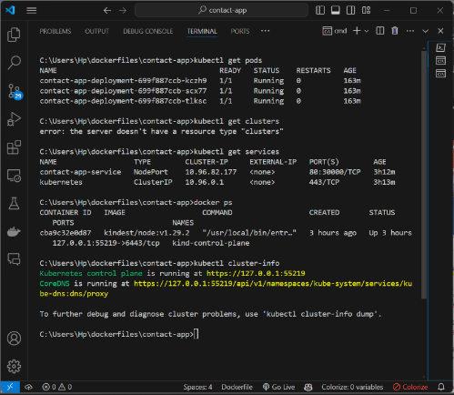 | 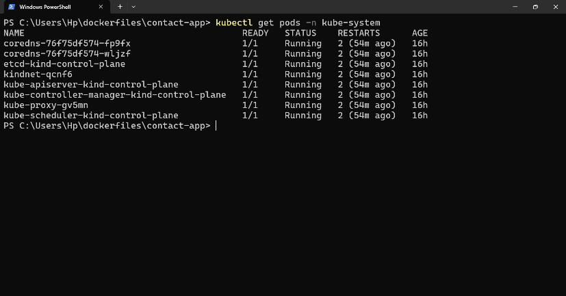 |
|--------------------------|--------------------------|
| 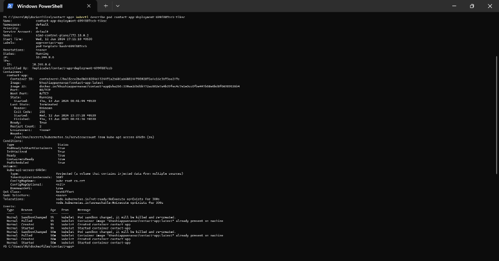 | 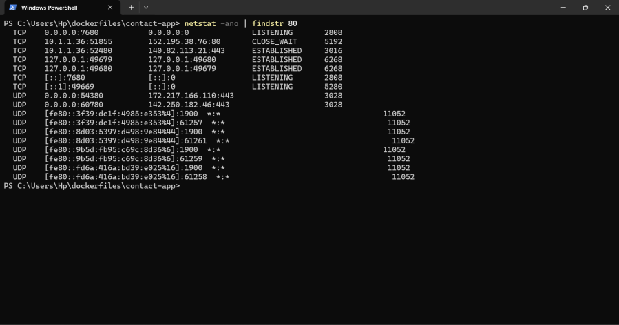 |

## Run the Docker Application Locally (Optional):
If you don't use Kubernetes, you can run the image directly. Use docker run with the -d flag to run in the background, -p 80:80 to map container port 80 to your host's port 80, and specify the image name. If you ran the image locally, open your web browser and navigate to http://localhost:8080/ to access your application.

| 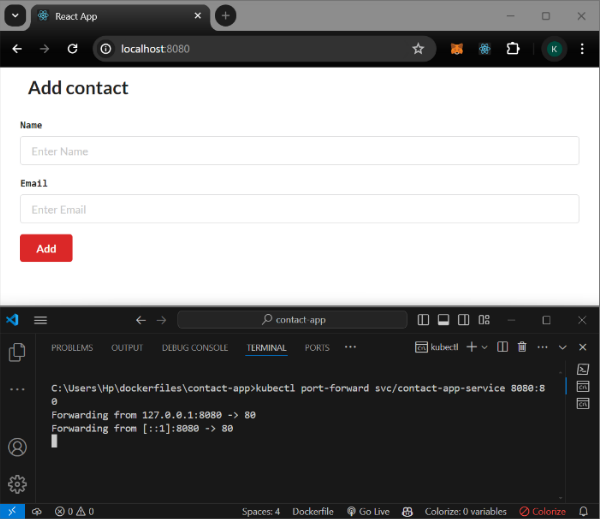 | 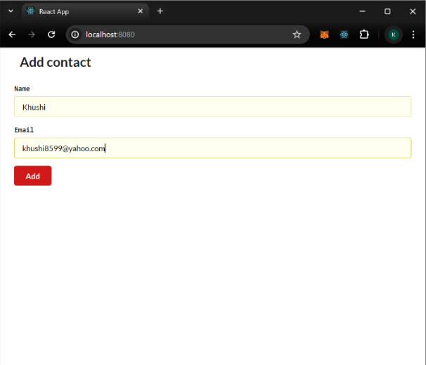 |
|---------------------------|---------------------------|
| 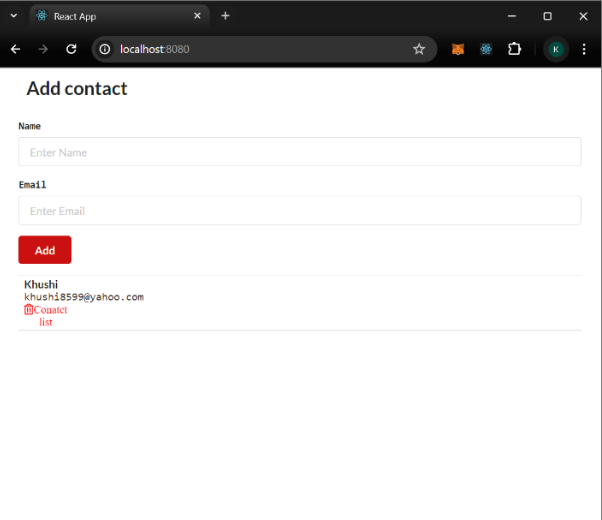 | 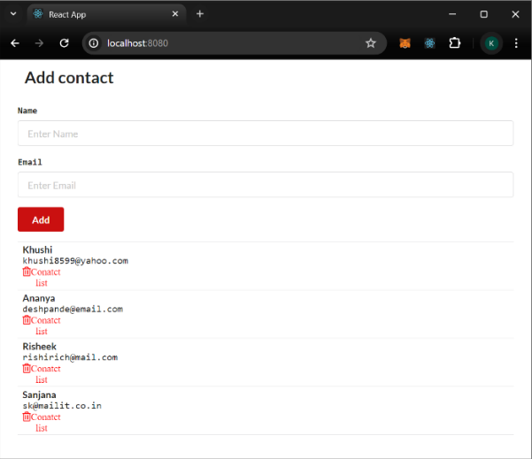 |